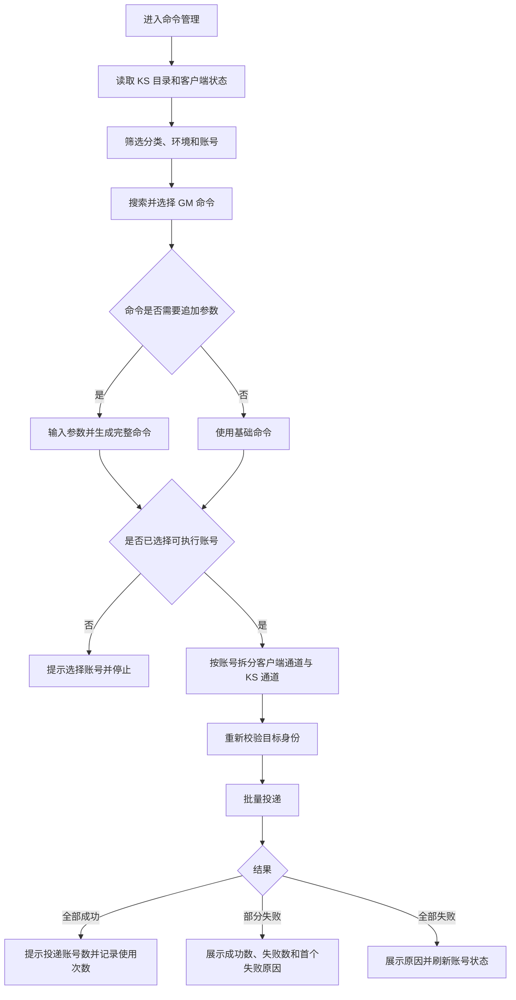
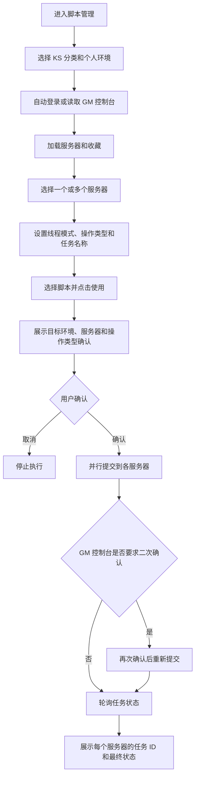
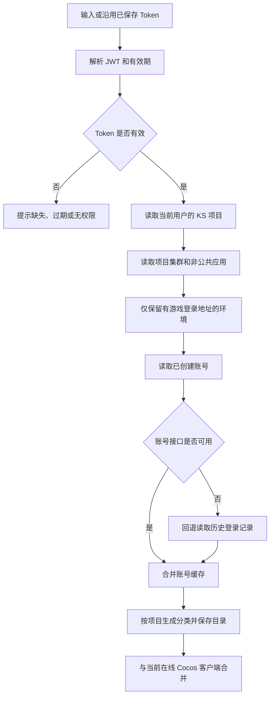

# GM 工具产品需求文档（PRD）

> 文档版本：V1.0  
> 文档日期：2026-07-27  
> 文档状态：基于当前已实现版本整理，可用于 Stitch 原型设计、产品评审和后续开发验收  
> 产品形态：内部 Web 工具  
> 说明：本文只定义产品内容、业务流程、交互状态与约束，不限定视觉风格

---

## 1. 文档目的

本文档以当前 GM 工具的真实功能、页面、接口和数据为基础，完整说明产品定位、用户角色、信息架构、核心流程、页面内容、业务规则、异常处理、数据结构和验收标准。

本文档主要用于：

1. 作为 Stitch 生成高保真原型的产品输入。
2. 保证重新设计界面时不遗漏现有功能和关键状态。
3. 统一产品、设计、开发、测试对 GM 执行链路的理解。
4. 作为后续前端复刻和业务逻辑接入的验收依据。

### 1.1 当前数据规模快照

以下数量仅用于帮助原型理解信息密度，实际页面必须使用动态数量：

| 数据类型 | 当前规模 |
| --- | ---: |
| GM 命令 | 约 489 条 |
| 带参数说明的 GM 命令 | 约 308 条 |
| 道具 | 约 1322 条 |
| 脚本 | 当前 1 条，后续可持续新增 |
| 计算公式 | 当前 1 条，后续可持续新增 |
| GM 分类 | 约 90 个 |
| 系统用户 | 当前 2 个 |
| Git 仓库 | 2 个：客户端、配置表 |

---

## 2. 产品概述

### 2.1 产品名称

GM 工具 / GM 命令管理工具。

### 2.2 产品定位

GM 工具是面向游戏测试、研发和运维人员的内部操作平台。它把分散的 GM 命令、KS 环境、游戏账号、Groovy 脚本、测试设计、配置表、代码更新和用户权限集中到一个入口中。

产品的核心价值不是展示数据，而是让用户在执行操作前明确回答以下问题：

- 当前登录身份是谁，具有什么权限？
- 当前选择的是哪个 KS 分类、环境、服务器和账号？
- 目标账号当前可通过哪条链路执行？
- 即将执行的命令或脚本完整内容是什么？
- 命令是否还缺少参数？
- 操作是否已经投递、部分失败或执行完成？
- 失败后用户下一步应该做什么？

### 2.3 主要问题

1. GM 命令数量多、分类多，人工查找成本高。
2. 同一人员在多个 KS 分类、个人环境和账号之间切换，容易选错目标。
3. 部分命令必须追加数字或其他参数，缺少参数时命令不能完整生效。
4. 游戏客户端在线执行与 KS 历史账号执行是两条不同链路，需要统一呈现。
5. Groovy 脚本需要先确定环境、服务器、线程模式、操作类型和任务名，步骤较多。
6. Git 拉取可能受到本地改动、未跟踪文件或 Excel/WPS 占用影响，需要提供可理解的处理结果。
7. 测试设计、道具查询、计算公式和 Skill 管理原本分散，需要统一入口。

---

## 3. 产品目标与边界

### 3.1 产品目标

#### G1：降低 GM 操作错误

执行前必须明确展示目标环境、目标账号、执行通道和完整命令；目标身份变化时禁止继续投递。

#### G2：提升命令查找与执行效率

支持全文搜索、分类筛选、使用频次排序、参数输入、批量选账号和一键执行。

#### G3：统一环境与账号来源

通过 KS Token 获取当前用户有权限的项目、个人环境和历史账号，并与当前在线游戏客户端合并展示。

#### G4：提供完整操作反馈

所有耗时操作必须具备加载、成功、失败、部分成功和可恢复提示；不能只依赖短暂提示消息。

#### G5：兼顾普通用户与管理员

普通用户以查询、复制、计算和测试设计为主；管理员负责数据维护、命令执行、环境同步、Git 拉取和用户管理。

### 3.2 非目标

当前版本不包含以下能力：

- 不替代 KS、GM 控制台、Git、Codex 或 SkillHub 本身。
- 不提供游戏业务数据看板、运营报表或监控大盘。
- 不在本工具内创建或删除 KS 环境。
- 不在本工具内创建游戏账号，只读取 KS 已创建账号和历史记录。
- 不提供通用代码编辑器或完整 Git 冲突解决器。
- 不保证 Cocos 通道投递成功等同于游戏服务器最终执行成功。
- 不提供完整的跨模块操作审计中心；当前只记录命令使用次数、最近使用时间及外部系统已有记录。

---

## 4. 用户与使用场景

### 4.1 用户角色

#### 管理员

典型人员：高级测试、研发、运维、工具管理员。

主要任务：

- 维护命令、脚本、公式和分类。
- 同步 KS 环境及账号。
- 向目标游戏账号发送 GM 命令。
- 在 GM 控制台批量执行 Groovy 脚本。
- 查看并拉取客户端和配置表仓库。
- 管理 SkillHub。
- 新增、编辑、删除工具用户。
- 自动更新道具表。

#### 普通用户

典型人员：功能测试、策划、需要查询 GM 信息的协作人员。

主要任务：

- 查询、查看和复制 GM 命令。
- 查询和复制脚本。
- 使用测试设计能力。
- 查询道具表。
- 使用计算公式。
- 修改自己的登录密码。

### 4.2 典型使用场景

1. 测试人员搜索“加货币”，输入货币类型与数量，选择某个个人环境下的账号后执行。
2. 管理员选择多个已创建账号，其中部分客户端在线、部分仅能通过 KS 执行，并一次投递同一命令。
3. 管理员选择个人环境和多个服务器，在 GM 控制台并行执行同一 Groovy 脚本。
4. 测试人员上传 PRD、表格或接口文档，选择测试设计模式并下载 Markdown 结果。
5. 测试人员按 ID 或名称查找道具，查看全部字段并复制 JSON。
6. 管理员检查客户端与配置表仓库的远端提交，按提交人过滤并执行拉取。
7. 配置表拉取因 Excel/WPS 占用失败，管理员确认文件已保存后使用自动处理并重试。

---

## 5. 角色权限

权限必须同时由前端可见性和服务端接口校验控制。隐藏入口不能替代服务端鉴权。

| 功能 | 普通用户 | 管理员 |
| --- | --- | --- |
| 登录、退出、修改本人密码 | 可用 | 可用 |
| 查看、搜索 GM 命令 | 可用 | 可用 |
| 查看、复制 GM 命令 | 可用 | 可用 |
| 执行 GM 命令 | 不可用 | 可用 |
| 新增、编辑、删除命令 | 不可用 | 可用 |
| 管理分类 | 不可用 | 可用 |
| 查看、搜索、复制脚本 | 可用 | 可用 |
| 执行脚本 | 不可用 | 可用 |
| 新增、编辑、删除脚本 | 不可用 | 可用 |
| 使用测试设计 | 可用 | 可用 |
| 查看 SkillHub 状态 | 不可用 | 可用 |
| 打开 SkillHub 或安装目录 | 不可用 | 可用 |
| 查看、搜索和计算公式 | 可用 | 可用 |
| 新增、编辑、删除公式 | 不可用 | 可用 |
| 查询道具表 | 可用 | 可用 |
| 自动更新道具表 | 不可用 | 可用 |
| 查看 Git 状态和提交 | 不可用 | 可用 |
| 拉取 Git 仓库 | 不可用 | 可用 |
| KS 环境与账号同步 | 不可用 | 可用 |
| 用户管理 | 不可用 | 可用 |

### 5.1 命令“权限等级”字段说明

命令中的“普通 / 管理员 / 超级管理员”目前是命令资料的展示字段，用于提示命令自身的使用要求，不直接等同于本工具的 `admin / user` 登录角色，也不参与自动鉴权。原型必须展示该字段，但不能让用户误以为它已经完成权限拦截。

---

## 6. 核心术语

| 术语 | 定义 |
| --- | --- |
| KS | 环境与账号来源平台，默认入口为 `https://zxty.tuyoo.com` |
| KS 分类 | KS 中按项目或业务分组得到的环境类别 |
| KS 环境 | 当前用户有权限访问的非公共应用环境 |
| 历史账号 | 从 KS 已创建账号或登录记录中读取并保留的账号 |
| Cocos 客户端 | 已开启自动测试并连接 GM 工具 WebSocket 的游戏客户端 |
| 客户端在线 | 当前存在可验证身份的 Cocos 连接 |
| KS 可执行 | 客户端不在线，但账号身份完整且可通过 KS 投递命令 |
| 可执行账号 | “客户端在线”或“KS 可执行”的账号 |
| GM 命令 | 发送给游戏账号的单条命令文本 |
| 追加参数 | 拼接在基础命令后的数字、字符串或多段参数 |
| GM 控制台脚本 | 通过目标环境的 GM 控制台执行的 Groovy 脚本 |
| 普通服 | 服务器 ID 大于 0 的服务器选项 |
| 收藏 | GM 控制台中保存的脚本和执行参数组合 |
| 投递成功 | 工具已将命令发送到目标通道，不必然代表游戏内最终业务结果成功 |

---

## 7. 信息架构

### 7.1 登录前

- 登录页
  - 用户名
  - 密码
  - 登录按钮
  - 错误提示

### 7.2 登录后全局区域

- 产品标识：GM 工具
- 一级导航
- 当前用户名和角色
- 修改密码
- 退出登录
- 页面缩放：50% 至 300%，步长 10%
- 深浅主题切换

### 7.3 一级导航

按当前功能顺序保留：

1. 命令管理
2. 脚本管理
3. 测试设计
4. Skill 管理，仅管理员
5. 计算公式
6. 道具表
7. Git 拉取，仅管理员
8. KS 环境同步，仅管理员
9. 用户管理，仅管理员

### 7.4 导航规则

- 未登录访问业务页时跳转登录页。
- 普通用户不展示管理员专属导航。
- 切换模块时加载该模块最新数据。
- 当前模块必须有明确选中状态。
- 页面刷新后至少恢复登录状态、主题、缩放和已缓存的 KS 环境目录。

---

## 8. 核心业务流程

### 8.1 GM 命令执行流程

### 8.2 GM 控制台脚本执行流程

### 8.3 KS 同步流程

---

## 9. 详细功能需求

### 9.1 登录与会话

#### 9.1.1 页面内容

- 产品名称：GM 命令管理工具。
- 用户名输入框。
- 密码输入框。
- 登录按钮。
- 页面内错误提示区域。
- 首次使用提示可以保留，但正式环境不应长期展示默认密码。

#### 9.1.2 交互规则

- 用户名和密码都不能为空。
- 用户名输入框按 Enter 后，焦点进入密码输入框。
- 密码输入框按 Enter 后提交登录。
- 提交期间登录按钮应进入禁用和加载状态，避免重复提交。
- 登录成功进入命令管理。
- 已登录用户访问登录页时自动进入业务页。
- 用户名或密码错误时停留当前页并显示“用户名或密码错误”。
- 服务未启动或网络异常时显示“网络错误，服务器可能未启动”。

#### 9.1.3 会话规则

- 登录成功后由服务端写入 HttpOnly Cookie。
- 所有业务接口都必须验证登录状态。
- 会话失效时统一跳转登录页，并避免用户继续在旧页面操作。
- 退出登录需要清除服务端会话和浏览器 Cookie。
- 当前会话保存在服务内存中，工具服务重启后用户需要重新登录。

#### 9.1.4 修改密码

- 任意已登录用户都可以修改自己的密码。
- 字段：原密码、新密码。
- 两个字段均必填。
- 原密码不正确时禁止修改。
- 修改成功后关闭弹窗并反馈成功。
- 密码不得在页面、日志或接口响应中明文回显。

---

### 9.2 全局工作区

#### 9.2.1 用户区

- 展示当前用户名。
- 展示角色中文名：管理员或普通用户。
- 提供修改密码和退出登录。

#### 9.2.2 主题

- 支持深色与浅色主题切换。
- 用户选择保存在浏览器本地。
- 主题切换只改变视觉，不改变信息结构和业务状态。

#### 9.2.3 缩放

- 支持输入 50 至 300 的百分比。
- 支持 `Ctrl/Cmd +`、`Ctrl/Cmd -` 和 `Ctrl/Cmd 0`。
- 默认 100%。
- 移动端实际缩放不得超过 100%，避免横向溢出。
- 用户设置保存在浏览器本地。

#### 9.2.4 通用反馈

- 轻量成功操作使用短提示，例如复制成功、保存成功。
- 耗时或结果复杂的操作必须使用页面内状态区，例如 Git 拉取、脚本执行、测试设计。
- 删除、批量执行、清空内容、自动关闭 Office 程序等高风险操作必须二次确认。
- 弹窗支持点击遮罩关闭，但执行中或有未保存内容时应避免误关闭。
- 所有列表必须具备加载、空数据、错误和正常状态。

---

### 9.3 命令管理

命令管理是产品首屏和最高频模块。

#### 9.3.1 页面结构

页面从上到下包含：

1. 页面标题与命令总数。
2. 搜索与分类工具栏。
3. KS 游戏账号选择区。
4. 按分类分组的命令列表。
5. 命令详情弹窗。
6. 新增/编辑命令弹窗，仅管理员。
7. 分类管理弹窗，仅管理员。

#### 9.3.2 搜索与筛选

#### 搜索范围

一个搜索框同时匹配：

- 命令名
- 命令内容
- 分类
- 标签
- 描述
- 参数说明
- 使用示例
- 权限等级

#### 筛选规则

- 支持选择“全部分类”或单个分类。
- 搜索与分类筛选可组合使用。
- 输入停止约 250 毫秒后自动查询。
- 按 Enter 或点击“查询”立即查询。
- 点击“清空”后清空关键词和分类，并恢复全部结果。
- 页面显示当前结果总数，而不是固定总量。

#### 9.3.3 命令排序与分组

- 命令按分类分组。
- 分类组显示分类名和组内数量。
- 分类顺序优先遵循分类管理中的顺序。
- 分类内部优先按使用次数降序，再按中文名称排序。
- 各分类的最高使用次数会影响分类组的整体顺序，高频分类优先。
- 未设置分类的命令归入“未分类”。

#### 9.3.4 KS 目标摘要

目标区顶部需要持续展示：

- Cocos 总体连接状态：检测中、已连接、未连接。
- 环境数量。
- 账号数量。
- 可执行账号数量。
- 当前客户端在线数量。
- 已选账号数量。
- 刷新状态操作。

#### 9.3.5 KS 分类与环境筛选

- KS 分类下拉项展示分类名和环境数量。
- KS 环境下拉项展示环境名、集群和命名空间。
- 选择分类后只显示该分类下的环境与账号。
- 选择环境后只显示该环境下的账号。
- 分类变化时清空已选的环境筛选。
- Token 过期时明确提示前往“KS 环境同步”更新。
- 管理员可从当前页触发“同步账号”。

#### 9.3.6 账号列表

#### 搜索范围

支持按以下信息搜索：

- 账号显示名
- 账号 ID
- 账号名
- 角色 ID
- 角色名
- 玩家 ID
- 服务器 ID
- 环境名
- 环境地址
- 客户端地址

#### 快速筛选

- 全部
- 客户端在线
- 已选

#### 批量操作

- 选择当前可见范围内的全部可执行账号。
- 清空全部选择。
- 页面显示“当前显示数 / 总数 / 已选数”。
- 当系统中只有一个可执行账号时，首次加载可自动选中该账号。
- 环境或账号状态刷新后，已经失效的选择必须自动移除。

#### 账号状态

| 状态 | 判定 | 是否可选 | 执行通道 |
| --- | --- | --- | --- |
| 客户端在线 | Cocos 已连接且身份完整 | 是 | Cocos |
| KS 可执行 | 客户端不在线，但 KS 环境及账号身份完整 | 是 | KS |
| 身份不完整 | 有连接但缺少账号、角色、服务器或环境身份 | 否 | 无 |
| 信息不完整 | 历史记录存在，但缺少执行所需字段 | 否 | 无 |

#### 账号卡片信息

- 账号显示名。
- 角色名，可用时展示。
- 账号 ID、角色 ID、服务器 ID。
- 所属环境。
- 当前状态标签。
- 客户端在线时展示端口和客户端标识摘要。
- KS 可执行时展示最近记录时间。
- 已选状态必须明显区别于未选状态。

#### 9.3.7 环境与连接详情

该区域可折叠，包含：

- 当前查看范围。
- 环境地址。
- 当前在线连接数。
- 多环境时提示先选择具体环境查看地址。

#### 9.3.8 命令卡片

每条命令显示：

- 命令名。
- 使用次数，有记录时显示。
- 命令权限等级，有值时显示。
- 基础命令内容。
- 追加参数输入框，满足规则时显示。
- 描述，有值时显示。
- 标签，有值时显示。
- 使用。
- 复制。
- 编辑，仅管理员。
- 删除，仅管理员。

点击卡片主体打开详情，点击输入框或操作按钮不能误触详情。

#### 9.3.9 追加参数

当前参数输入规则：当“参数说明”不为空，且基础命令本身不包含空格时，认为该命令需要用户追加参数。

交互要求：

- 输入框占位文案使用“输入参数：{参数说明}”。
- 用户可以输入单个数字、多个参数或字符串，产品不在前端强制改写内容。
- 最终命令格式为“基础命令 + 一个空格 + 用户输入内容”。
- 参数必填命令在未输入参数时，点击“使用”或“复制”都必须停止操作、聚焦输入框并提示“请先输入参数”。
- 参数输入框按 Enter 等同于点击“使用”。
- 卡片与详情弹窗各自保留独立的参数输入位置。
- 原型必须覆盖“无参数命令”“需要单个数字”“需要多个参数”三种样例。

#### 9.3.10 使用命令

前置条件：

- 当前用户是管理员。
- 命令内容非空。
- 必要参数已填写。
- 至少选择一个可执行账号。

执行规则：

1. 生成完整命令。
2. 将已选账号拆分为 Cocos 在线账号和 KS 可执行账号。
3. 提交前使用账号身份快照重新校验目标，防止账号切换后误发。
4. 两种通道可在同一次操作中同时执行。
5. 成功后提示已投递命令名和账号数量。
6. 成功投递后命令使用次数加 1，并记录最近使用时间。
7. 投递完成后刷新账号状态。

#### Cocos 通道

- 客户端连接端口默认 5101。
- 提交前确认连接仍在线。
- 重新读取目标身份，并比对连接 ID、客户端 ID、账号、角色、服务器和环境。
- 任一关键身份缺失或变化时，本次命令不发送，并提示刷新状态后重新选择。
- Cocos 返回投递成功后，应提示“游戏服务器是否执行成功请以游戏内结果为准”。

#### KS 通道

- 仅允许当前用户 KS 目录中的非公共个人环境。
- 必须具备环境应用名、登录地址、账号名、角色 ID 和服务器 ID。
- Token 缺失或过期时禁止执行。
- 多账号并发投递，当前最大并发数为 4。
- 返回每个账号的成功或失败结果。

#### 混合执行结果

- 全部成功：显示已投递账号总数。
- 部分失败：显示成功数、失败数和可理解的失败原因。
- 全部失败：显示失败原因，不增加使用次数。
- 目标环境或账号已变化：要求重新同步并重新选择。

#### 9.3.11 复制命令

- 无参数命令复制基础命令。
- 有参数命令复制完整拼接后的命令。
- 缺少参数时不能复制。
- 复制成功后增加使用次数。
- 浏览器不允许访问剪贴板时提示用户手动选择。

#### 9.3.12 命令详情

详情展示：

- 命令内容。
- 分类。
- 使用次数与最近使用时间。
- 权限等级。
- 标签。
- 参数说明。
- 追加参数输入框。
- 使用示例。
- 描述。
- 使用和复制操作。

#### 9.3.13 新增与编辑命令

| 字段 | 必填 | 规则 |
| --- | --- | --- |
| 命令名 | 是 | 去除首尾空格后不能为空 |
| 分类 | 否 | 从分类列表选择 |
| 命令内容 | 是 | 去除首尾空格后不能为空 |
| 权限等级 | 否 | 未设置、普通、管理员、超级管理员 |
| 标签 | 否 | 使用逗号分隔，保存为数组 |
| 参数说明 | 否 | 描述追加参数的名称、类型或含义 |
| 使用示例 | 否 | 展示完整可执行示例 |
| 描述 | 否 | 说明用途、影响和注意事项 |

- 新增时生成唯一 ID、创建时间和更新时间。
- 编辑时保留原 ID 和创建时间，更新修改时间。
- 保存成功后关闭弹窗并刷新列表。

#### 9.3.14 删除命令

- 仅管理员可用。
- 删除前必须确认。
- 删除成功后刷新列表。
- 命令已不存在时提示“命令不存在”。

#### 9.3.15 分类管理

- 新增分类：名称不能为空，不能与现有分类重复。
- 重命名分类：新名称不能为空，不能重复。
- 重命名时同步更新使用旧分类的命令记录，并反馈更新数量；脚本和公式中的旧分类当前不会自动修改。
- 删除分类：只删除分类选项，不修改已经使用该分类的历史记录。
- 分类删除前必须明确说明上述影响并确认。

#### 9.3.16 空状态与异常状态

原型至少覆盖：

- 正在读取 KS 环境和账号。
- 尚未配置 KS Token。
- KS Token 已过期。
- KS 目录无环境。
- 环境存在但无账号。
- 当前筛选下无账号。
- Cocos 未连接。
- 命令列表无结果。
- 未选择账号。
- 参数未填写。
- 目标客户端离线或身份变化。
- 全部成功、部分失败、全部失败。

---

### 9.4 脚本管理

#### 9.4.1 页面结构

1. 标题与脚本总数。
2. 搜索、分类和新增工具栏。
3. GM 控制台执行目标配置区。
4. 按分类分组的脚本列表。
5. 脚本详情弹窗。
6. 新增/编辑脚本弹窗。

#### 9.4.2 搜索与分组

- 搜索范围：脚本名、脚本内容、分类、标签和描述。
- 支持分类筛选、自动搜索、按 Enter 查询和清空。
- 脚本按公共分类体系分组。
- 卡片预览脚本前 3 个非空行；超过 3 行时展示总行数。

#### 9.4.3 KS 目标选择

- 展示 KS 分类下拉框及环境数量。
- 只允许选择具体个人环境，不能在“全部环境”下执行。
- 环境显示名称、集群和命名空间。
- 选择环境后自动加载对应 GM 控制台服务器和收藏。
- Token 过期、无环境、未选择环境时显示对应提示。

#### 9.4.4 GM 控制台认证

仅管理员可操作认证信息。

支持两种方式：

1. 输入 GM 账号和密码后登录并加载。
2. 粘贴 GM 控制台 `localStorage.token` 作为备用 Token。

规则：

- 环境、账号、密码均需校验。
- 密码输入完成登录后立即清空。
- Token 和密码都以密码框形式展示，不能明文回显。
- 已保存登录信息可用于自动登录。
- 登录失效时提示重新登录 GM 控制台。

#### 9.4.5 服务器选择

- 服务器列表支持多选。
- 每项展示服务器名称和服务器 ID。
- 初次加载后默认选中第一个服务器 ID 大于 0 的普通服。
- “全选普通服”只选择 ID 大于 0 的服务器。
- “清空”取消全部服务器选择。
- 摘要区显示服务器选项数量和已选数量。

#### 9.4.6 收藏

- 收藏下拉框默认“不使用收藏”。
- 选择收藏后读取收藏详情。
- 收藏可自动填入任务名称、服务器、线程模式等参数。
- 收藏包含 Groovy 脚本时，将脚本复制到剪贴板，并提示可新增到脚本管理。
- 收藏读取失败时保留当前页面配置并提示错误。

#### 9.4.7 执行配置

| 字段 | 必填 | 选项/规则 |
| --- | --- | --- |
| KS 环境 | 是 | 必须选择具体个人环境 |
| 服务器 ID | 是 | 至少选择 1 个，可多选 |
| 执行线程模式 | 是 | 异步线程（默认）、主线程 |
| 操作类型 | 是 | 只读操作（默认）、写操作 |
| 任务名称 | 是 | 最长 15 个字符 |
| 脚本内容 | 是 | 来自当前脚本卡片 |

#### 9.4.8 脚本执行

- 普通用户可以查看和复制脚本，但不能执行。
- 管理员点击“使用”后校验环境、服务器、任务名和脚本内容。
- 首次确认必须明确展示环境名、服务器数量或 ID、脚本名和操作类型。
- 多服务器并行提交。
- GM 控制台返回“需要二次确认”时，必须再次询问用户；用户取消则停止。
- 每个服务器生成独立任务 ID。
- 工具每 5 秒轮询一次任务状态，最多 10 次。
- 超过轮询时间仍未完成时显示“仍在执行中”，并提供操作记录入口。

#### 9.4.9 执行结果

批量结果至少包含：

- 总目标服务器数量。
- 成功数量。
- 失败数量。
- 每个服务器 ID。
- 状态：成功、失败、已提交、执行中。
- 任务 ID。
- 返回消息。
- 操作记录链接。

结果区状态：默认说明、加载中、成功、部分失败、失败、已取消。

#### 9.4.10 脚本卡片与详情

卡片显示：

- 脚本名。
- 内容预览。
- 描述。
- 标签。
- 使用。
- 复制。
- 编辑和删除，仅管理员。

详情显示完整脚本、分类、标签和描述，并提供使用和复制。

#### 9.4.11 新增与编辑脚本

| 字段 | 必填 | 规则 |
| --- | --- | --- |
| 脚本名 | 是 | 不能为空 |
| 分类 | 否 | 使用公共分类 |
| 脚本内容 | 是 | 保留换行，不允许全空白 |
| 标签 | 否 | 逗号分隔 |
| 描述 | 否 | 说明用途和风险 |

- 删除前必须确认。
- 保存成功后刷新列表。

---

### 9.5 测试设计

#### 9.5.1 功能目标

用户可导入需求文档或填写说明，选择生成方式后，由 Codex `qa-test-design` Skill 或本地 Qwen3/本地规则引擎生成测试设计。

#### 9.5.2 引擎切换

- Codex 设计。
- 本地 Qwen3。
- 每个引擎展示名称、能力标识和可用状态。
- 切换引擎时保留各自已生成结果，切回后恢复。
- 当前引擎不可用时禁用生成并给出原因。
- Codex 超时后，如果本地引擎可用，可自动回退并在结果状态中说明。

#### 9.5.3 需求配置

| 字段 | 必填 | 规则 |
| --- | --- | --- |
| 需求标题 | 否 | 最长 120 个字符 |
| 交付模式 | 是 | 完整测试设计、测试点、详细测试用例、需求评审、变更影响测试 |
| 业务领域 | 是 | 自动识别、游戏与 GM 工具、Web 界面、API 与服务端、Excel/CSV 配置表 |
| 设计深度 | 是 | 精简、标准、深入；默认标准 |
| 需求文件 | 条件必填 | 与补充说明至少有一项 |
| 补充说明 | 条件必填 | 最长 12000 字符，与需求文件至少有一项 |

#### 9.5.4 文件上传

支持格式：

- PDF
- Word `.docx`
- Excel `.xlsx`
- CSV
- PowerPoint `.pptx`
- TXT
- Markdown

限制：

- 一次最多 8 个文件。
- 单文件不超过 100 MB。
- 单次请求总大小不超过 200 MB。
- Office 文件解压后不超过 500 MB。
- 不支持加密或结构损坏的 Office 文件。
- 上传文件按当前登录用户隔离。
- 临时文件约 1 小时后自动过期。

交互：

- 支持点击选择和拖放。
- 上传后展示文件名和大小。
- 支持逐个移除。
- 上传中禁用生成按钮。
- 文件无效时说明具体文件和原因。

#### 9.5.5 生成过程

- 无文件且无补充说明时禁止生成。
- 展示生成中状态和已耗时。
- 同一引擎已有任务运行时提示稍后再试。
- Codex 默认最长执行时间为 300 秒。
- 服务不可用、忙碌、超时、认证失败和生成失败需要不同提示。

#### 9.5.6 结果区

展示模式：

- 预览：渲染 Markdown 标题、列表、表格、引用和代码块。
- Markdown：展示原始文本。
- JSON：仅在返回结构化数据时启用。

操作：

- 复制当前模式内容。
- 下载 Markdown 或 JSON。
- 文件名使用需求标题和当前日期；非法文件名字符自动替换。

结果状态显示：

- 生成完成。
- 实际耗时。
- 使用的引擎与 Skill。
- 是否由 Codex 自动回退到本地引擎。

#### 9.5.7 清空

- 有需求、文件或结果时必须确认。
- 清空标题、说明、模式、领域、深度、上传文件和两个引擎的结果。
- 恢复默认值：完整测试设计、自动识别、标准深度。

---

### 9.6 Skill 管理

仅管理员可见。

#### 9.6.1 页面内容

- AI SkillHub 高级管理工具说明。
- 安装状态。
- 当前版本。
- 已识别的 Codex Skill 数量。
- 用户数据目录状态。
- 安装目录或预期目录。
- 打开工具。
- 打开安装目录。
- 刷新状态。
- GitHub 项目入口。

#### 9.6.2 状态

- 检测中。
- 已安装。
- 未安装。
- 读取失败。
- 工具打开成功或失败。
- 目录打开成功或失败。

#### 9.6.3 当前集成边界

- GM 工具只负责检测和启动独立 SkillHub 应用。
- Skill 的安装、评分、来源、路由和同步在 SkillHub 应用内完成。
- GM 工具中的 Skill 数量来自本机 Codex Skills 目录扫描。

---

### 9.7 计算公式

#### 9.7.1 列表

- 展示公式总数。
- 支持按公式名、表达式、变量、分类和描述搜索。
- 支持分类筛选与清空。
- 公式按分类分组。
- 卡片展示公式名、表达式、描述和变量标签。
- 点击卡片或“计算”打开计算器。
- 管理员可编辑和删除。

#### 9.7.2 新增与编辑

| 字段 | 必填 | 规则 |
| --- | --- | --- |
| 公式名 | 是 | 不能为空 |
| 分类 | 否 | 使用公共分类 |
| 表达式 | 是 | 不能为空 |
| 变量列表 | 否 | 逗号分隔；留空时从表达式自动提取 |
| 描述 | 否 | 可说明单位和取值范围 |

#### 9.7.3 计算器

- 展示公式名称、表达式和描述。
- 根据表达式中识别到的变量动态生成数字输入框。
- 所有变量填写后实时计算。
- 支持整数和小数。
- 整数使用千分位格式。
- 小数最多保留 6 位。
- 支持全角括号、全角运算符和中文变量名的标准化。
- 支持 `abs`、`min`、`max`、`pow`、`sqrt`、`floor`、`ceil`、`round`、`log`、`exp`、`PI`、`E`。
- 禁止分号、大括号、赋值、模板字符串和其他不受支持的表达式内容。
- 结果不是有限数字时显示“无法计算”。
- 表达式非法时展示明确原因。
- 支持复制结果。

---

### 9.8 道具表

#### 9.8.1 数据来源

- 来源为配置表项目中的 `COA_Item.xlsx`。
- 当前表头字段位于第 2 行，数据从第 11 行开始。
- 更新后生成本工具可查询的道具数据缓存。

#### 9.8.2 查询

- 支持按 ID、名称、描述或任意字段全文搜索。
- 输入停止约 250 毫秒后自动查询。
- 支持按 Enter 查询和清空。
- 显示结果总数和最近更新时间。

#### 9.8.3 列表字段

列表固定展示：

- `id`
- `name`
- `nameComment`
- `color`
- `functionType`
- `maxStack`
- 查看详情

#### 9.8.4 详情

- 标题优先使用 `nameComment`，其次 `name`、`id`。
- 按源表字段顺序展示所有非空字段。
- 支持复制完整 JSON。

#### 9.8.5 自动更新

- 仅管理员可用。
- 更新中按钮禁用并显示进度状态。
- 更新成功后提示导入数量并刷新列表。
- 源文件不存在、结构不正确、文件被占用或解析失败时展示具体原因。

---

### 9.9 Git 拉取

仅管理员可见。

#### 9.9.1 仓库范围

当前固定管理：

- 客户端仓库。
- 配置表仓库。

#### 9.9.2 状态检查

每个仓库展示：

- 仓库名称和路径。
- 当前分支。
- 当前提交短哈希。
- 上游分支。
- 工作区状态。
- 是否有本地改动。
- 远端待拉取提交。
- 本地领先提交。
- 最近历史提交，最多读取 80 条。
- 远端刷新失败原因。

检查过程需要展示分阶段进度，而不是空白等待。

#### 9.9.3 提交人筛选

- 支持按提交人名称模糊搜索。
- 同时过滤远端待拉取、本地提交和历史提交。
- 显示过滤前后数量。
- 清空后恢复全部。

#### 9.9.4 提交和改动详情

用户点击提交或本地改动后，按需加载详情，展示：

- 仓库。
- 类型。
- 提交人。
- 时间。
- 提交标识。
- 提交主题。
- Git 摘要。
- 对游戏内容影响的中文分析。
- Diff 中文说明。
- 原始 Diff。
- 涉及的文件。
- 复制完整详情。

配置表 Excel 变更额外展示：

- 文件名和状态。
- 工作表。
- 变化列与表头。
- 新增、删除、修改单元格。
- 修改前和修改后值。
- 只展示有变化的字段与表头，避免整表噪音。

#### 9.9.5 拉取操作

- 支持单仓库拉取。
- 支持全部仓库依次拉取。
- 拉取任务在后台执行，前端轮询进度。
- 执行期间禁止重复创建相同拉取操作。
- 显示百分比、当前仓库、阶段和详情。

当前拉取规则：

1. 读取拉取前状态。
2. 配置表仓库先检测 Excel/WPS 锁文件。
3. 自动暂存已跟踪的本地改动。
4. 使用只允许快进的拉取方式。
5. 如果未跟踪文件阻塞覆盖，尝试只暂存阻塞文件后重试。
6. 拉取完成后刷新仓库状态。
7. 自动暂存的内容保留在 Git stash 中，不自动丢弃。

#### 9.9.6 拉取结果

- 展示每个仓库的成功或失败。
- 展示 Git 原始输出和处理说明。
- 成功后刷新远端、本地和历史提交列表。
- 失败时说明失败类型、原因和下一步操作。

#### 9.9.7 配置表占用处理

当配置表拉取因 Excel/WPS 占用失败时：

- 自动弹出“配置表拉取失败”。
- 展示被占用文件或失败原因。
- 提供“解决并重新拉取”。
- 操作前明确提示用户保存表格内容。
- 用户确认后，工具可尝试关闭 `WPS / ET / Excel` 进程并清理锁文件，再重新拉取。
- 该操作具有数据丢失风险，必须使用高风险确认，不能静默执行。
- 无法关闭或清理时展示剩余锁文件和错误。

#### 9.9.8 远端刷新回退

如果本地文件占用导致无法更新工作区，工具仍可尝试刷新远端引用，使用户看到远端待拉取提交；页面必须明确区分“远端信息已刷新”和“本地工作区已成功更新”。

---

### 9.10 KS 环境与账号同步

仅管理员可见。

#### 9.10.1 输入

- KS Token 或包含 Authorization 的请求头文本。
- KS 地址，可选。
- 地址为空时使用已保存地址，首次默认 `https://zxty.tuyoo.com`。
- Token 为空时沿用已保存 Token。

#### 9.10.2 Token 识别

- 支持标准 JWT。
- 解析用户、姓名、邮箱、组织、租户、应用和过期时间。
- 不验证前端签名，但服务端调用 KS 接口时由 KS 权限验证最终有效性。
- Token 缺失、格式错误、过期、401 无权限需要不同提示。
- Token 或完整 Authorization 文本都可识别。

#### 9.10.3 环境读取规则

- 读取当前用户可访问的 KS 项目。
- 读取项目下集群。
- 读取集群下未删除、未回收的非公共应用。
- 只保留具有“游戏登录地址”的应用。
- 以项目名称作为 KS 分类。
- 环境记录包含名称、应用名、集群、命名空间、状态、登录地址和相关链接。
- 公共应用不作为 GM 执行目标。

#### 9.10.4 账号读取规则

- 优先读取 KS 已创建账号。
- 已创建账号接口失败时，回退读取登录案例记录。
- 账号至少尝试识别账号名、账号 ID、角色 ID、角色名、服务器 ID、最近操作时间。
- 同一环境与身份的历史记录去重合并。
- 新同步结果与已有缓存合并，防止短期接口缺失导致历史账号消失。
- 单环境最多保留最近 500 个账号。
- 单个环境账号读取失败不应导致全部环境同步失败；该环境记录错误信息并继续其他环境。

#### 9.10.5 同步结果

成功页展示：

- 环境数量。
- 历史账号数量。
- 数据来源地址。
- Token 用户资料。
- 环境表：名称、环境、集群、命名空间、状态、分支。
- 同步说明。
- 可展开的接口尝试记录，最多展示前 12 条。

失败页展示明确原因，保留用户输入的 KS 地址以便修正；出于安全考虑，Token 输入不应在失败后长期明文保留。

#### 9.10.6 缓存与自动同步

- 服务端保存 KS 地址、Token、环境目录和账号缓存。
- 浏览器保存最近一次 KS 目录，用于页面快速展示。
- 管理员登录且 Token 已配置、未过期时，每个浏览器会话自动同步一次。
- 命令页每 5 秒刷新当前 Cocos 在线状态，并与 KS 缓存合并。
- Token 过期后保留环境历史信息，但禁止依赖 KS 的执行操作。

---

### 9.11 用户管理

仅管理员可见。

#### 9.11.1 列表

展示：

- 用户名。
- 角色。
- 创建时间。
- 当前登录用户标记“我”。
- 编辑。
- 删除，当前用户不展示删除入口。

#### 9.11.2 新增用户

| 字段 | 必填 | 规则 |
| --- | --- | --- |
| 用户名 | 是 | 不能为空且全局唯一 |
| 密码 | 是 | 不能为空 |
| 角色 | 是 | 管理员、普通用户；默认普通用户 |

#### 9.11.3 编辑用户

- 用户名不可修改。
- 可修改角色。
- 可重置密码；留空表示不修改密码。
- 不能把系统中唯一管理员降级为普通用户。

#### 9.11.4 删除用户

- 删除前必须确认。
- 不能删除当前登录账号。
- 不能删除系统中唯一管理员。
- 用户不存在时提示“用户不存在”。

---

## 10. 数据模型

### 10.1 GM 命令

| 字段 | 类型 | 说明 |
| --- | --- | --- |
| `id` | string | 唯一标识 |
| `name` | string | 命令名 |
| `command` | string | 基础命令 |
| `category` | string | 分类 |
| `tags` | string[] | 标签 |
| `params` | string | 参数说明 |
| `example` | string | 使用示例 |
| `permission` | string | 命令资料权限等级 |
| `description` | string | 描述 |
| `usage_count` | number | 使用次数 |
| `last_used_at` | datetime | 最近使用时间 |
| `create_time` | datetime | 创建时间 |
| `update_time` | datetime | 更新时间 |

### 10.2 脚本

| 字段 | 类型 | 说明 |
| --- | --- | --- |
| `id` | string | 唯一标识 |
| `name` | string | 脚本名 |
| `content` | string | Groovy 脚本内容 |
| `category` | string | 分类 |
| `tags` | string[] | 标签 |
| `description` | string | 描述 |
| `create_time` | datetime | 创建时间 |
| `update_time` | datetime | 更新时间 |

### 10.3 公式

| 字段 | 类型 | 说明 |
| --- | --- | --- |
| `id` | string | 唯一标识 |
| `name` | string | 公式名 |
| `expression` | string | 表达式 |
| `variables` | string[] | 变量列表 |
| `category` | string | 分类 |
| `description` | string | 描述 |
| `create_time` | datetime | 创建时间 |
| `update_time` | datetime | 更新时间 |

### 10.4 KS 环境

| 字段 | 类型 | 说明 |
| --- | --- | --- |
| `key` | string | 环境唯一标识 |
| `name` | string | 环境名称 |
| `app_name` | string | KS 应用名 |
| `category` | string | 项目分类 |
| `project_id` | string | KS 项目 ID |
| `cluster` | string | 集群 |
| `namespace` | string | 命名空间 |
| `status` | string | KS 状态 |
| `login_url` | string | 游戏登录地址 |
| `links` | string[] | 相关环境链接 |
| `accounts` | Account[] | 环境账号 |
| `account_count` | number | 账号数 |
| `online_count` | number | 当前客户端在线数 |
| `executable_count` | number | 可执行账号数 |

### 10.5 KS/客户端账号

| 字段 | 类型 | 说明 |
| --- | --- | --- |
| `id` | string | 页面目标标识 |
| `cache_id` | string | KS 历史账号缓存标识 |
| `account_name` | string | 账号名 |
| `account_label` | string | 页面显示名 |
| `account_id` | string | 账号 ID |
| `role_id` | string | 角色 ID |
| `role_name` | string | 角色名 |
| `server_id` | string | 服务器 ID |
| `environment_key` | string | 所属环境 |
| `last_seen` | datetime | 最近记录时间 |
| `connected` | boolean | Cocos 是否在线 |
| `dispatchable` | boolean | 是否可通过 Cocos 执行 |
| `ks_dispatchable` | boolean | 是否可通过 KS 执行 |
| `connection_id` | string | Cocos 连接标识 |
| `client_id` | string | 客户端标识 |
| `port` | string | 客户端端口 |

### 10.6 用户

| 字段 | 类型 | 说明 |
| --- | --- | --- |
| `id` | string | 用户唯一标识 |
| `username` | string | 登录用户名 |
| `role` | enum | `admin` 或 `user` |
| `role_label` | string | 角色中文名 |
| `create_time` | datetime | 创建时间 |

密码、盐值等认证字段不得传给前端。

---

## 11. 外部系统与依赖

| 依赖 | 用途 | 不可用时影响 | 页面处理 |
| --- | --- | --- | --- |
| KS | 环境、账号、KS 命令投递 | 无法同步环境或执行离线账号命令 | 保留历史目录，提示 Token/网络问题 |
| Cocos WebSocket | 在线客户端身份与命令投递 | 在线账号无法执行 | 显示未连接，可继续使用 KS 可执行账号 |
| GM 控制台 | 服务器列表、收藏、脚本执行 | 脚本无法执行 | 保留脚本查询和复制，提示重新登录 |
| Git | 客户端、配置表更新 | 无法检查或拉取 | 展示仓库级错误与原始输出 |
| Excel/WPS | 配置表可能被打开 | Git 无法覆盖被占用文件 | 高风险确认后关闭进程并重试 |
| Codex CLI + qa-test-design | AI 测试设计 | Codex 生成不可用 | 可切本地引擎或自动回退 |
| 本地 Qwen3/规则引擎 | 本地测试设计 | 本地生成不可用 | 展示不可用原因，保留 Codex 入口 |
| AI SkillHub | Skill 高级管理 | 无法启动独立管理器 | 展示未安装或启动失败 |
| COA_Item.xlsx | 道具数据来源 | 无法更新道具缓存 | 保留旧数据并说明更新失败 |

---

## 12. 全局状态与错误规范

### 12.1 页面状态

每个模块至少设计：

- 初始状态。
- 加载状态。
- 正常有数据状态。
- 空数据状态。
- 搜索无结果状态。
- 权限不足状态。
- 网络或服务错误状态。
- 操作成功状态。
- 可恢复失败状态。
- 不可恢复失败状态。

### 12.2 错误信息要求

- 说明发生了什么，而不是只显示“失败”。
- 说明本次操作是否已经发送或执行。
- 说明是否有部分目标成功。
- 给出下一步动作，例如刷新、重新选择、更新 Token、重新登录、关闭文件。
- 接口返回 HTML 或无效数据时提示重启工具服务，不在页面直接展示大段网页源码。
- 敏感信息不能出现在错误提示中。

### 12.3 长任务

以下操作必须有持续状态：

- KS 环境与账号同步。
- GM 控制台登录与服务器加载。
- 多服务器脚本执行与轮询。
- Git 状态检查与拉取。
- 测试设计生成。
- 道具表自动更新。

长任务进行中应禁用重复触发按钮；任务完成后恢复。

---

## 13. 响应式与可用性要求

本文不限定视觉风格，但原型必须保证以下可用性：

### 13.1 桌面端

- 目标画布建议 1440×900 或同等桌面尺寸。
- 一级导航长期可见或可快速展开。
- 命令列表、目标选择和操作反馈之间层级清楚。
- 高密度数据区允许滚动，但主要操作不能离开上下文。
- 表格列宽稳定，长文本可截断并通过详情查看。

### 13.2 移动端/窄屏

- 目标画布建议 390×844。
- 不出现全页面横向滚动。
- 导航可折叠，但当前模块和用户操作可访问。
- 工具栏按逻辑换行，主操作不能被挤出屏幕。
- 命令卡片单列展示。
- 账号选择、参数输入和“使用”按钮保持可操作。
- 宽表格可转换为行详情或局部横向滚动，不允许正文整体溢出。
- 移动端页面缩放上限为 100%。

### 13.3 无障碍与键盘

- 输入框必须有可识别标签。
- 按钮禁用状态明显且不可触发。
- 颜色不能作为唯一状态区分方式，状态必须有文本。
- 焦点状态清晰。
- 弹窗打开后键盘焦点进入弹窗；关闭后返回触发位置。
- 上传区支持 Enter 和 Space 打开文件选择。
- 重要结果区域使用适合辅助技术识别的实时状态语义。

---

## 14. 非功能需求

### 14.1 性能

- 本地网络正常时，登录后业务外壳建议 2 秒内可操作。
- 约 500 条命令、1300 条道具的搜索反馈建议在 300 毫秒内出现。
- 搜索输入使用约 250 毫秒防抖，避免每次按键都造成明显闪烁。
- Cocos 状态每 5 秒刷新一次，不因轮询阻塞页面操作。
- Git 提交详情按需加载，避免列表首次加载逐条读取 Diff。
- 长任务在后台执行，页面持续展示进度。

### 14.2 安全

- 所有写操作和管理员接口都由服务端校验管理员角色。
- 登录 Cookie 使用 HttpOnly 和 SameSite=Lax。
- 密码、KS Token、GM Token 和 Cookie 不在页面明文回显。
- 用户接口不返回密码散列或盐值。
- 外部链接使用新窗口打开并隔离来源页面。
- QA 上传文件按用户隔离、限制类型和大小，并检查 Office 压缩包安全。
- 公式执行只允许受控数学表达式。
- Cocos 执行前必须重新校验目标身份。
- 自动关闭 Office 进程必须获得明确确认。

### 14.3 可靠性

- JSON 数据写入使用临时文件替换，避免中途写坏主文件。
- 单个 KS 环境账号读取失败不阻塞其他环境。
- 批量执行必须返回每个目标的结果，不只返回总体状态。
- 网络失败后不应清空用户已填写的非敏感配置。
- Git 后台任务结果至少保留 30 分钟，便于前端轮询。
- 选中的账号、服务器在数据刷新后必须剔除已失效项。

### 14.4 兼容性

- 主要支持 Windows 本地环境和现代 Chromium 浏览器。
- 中文内容、中文变量名、中文路径和 UTF-8 数据必须正确显示。
- 剪贴板能力不可用时提供明确回退提示。

---

## 15. 原型页面与状态清单

Stitch 原型至少需要输出以下页面或关键状态，不要求每个状态都做成独立视觉页面，但必须能在原型中被查看和理解。

### 15.1 登录

- 默认登录页。
- 用户名/密码为空。
- 账号密码错误。
- 服务未启动。

### 15.2 命令管理

- KS 已同步、存在多个分类和环境。
- 同一列表混合展示客户端在线、KS 可执行和不可执行账号。
- 已选择多个账号。
- 命令列表有多个分类和高密度数据。
- 带单个数字参数的命令。
- 带多个参数的命令。
- 命令详情。
- 新增/编辑命令。
- 分类管理。
- 未配置 Token。
- Token 过期。
- 无环境/无账号。
- 投递全部成功、部分失败、目标身份变化。

### 15.3 脚本管理

- 未选择环境。
- GM 控制台加载中。
- GM 控制台已就绪。
- 多服务器选择。
- 收藏加载。
- 执行确认。
- 二次确认。
- 批量执行成功和部分失败结果。
- 新增/编辑脚本和脚本详情。

### 15.4 测试设计

- Codex 可用、本地引擎可用。
- 文件拖放与文件列表。
- 生成中和计时。
- Markdown 预览。
- 原始 Markdown。
- 结构化 JSON。
- Codex 超时后回退本地引擎。
- 文件格式或大小错误。

### 15.5 其他模块

- SkillHub 已安装和未安装。
- 公式列表、公式编辑、计算器成功和表达式错误。
- 道具列表、搜索无结果、道具详情、自动更新中。
- Git 仓库状态、按提交人筛选、提交详情、Excel 字段对比、拉取进度、配置表占用失败处理。
- KS 同步输入、成功结果、Token 过期、无权限和接口尝试记录。
- 用户列表、新增用户、编辑角色、重置密码、唯一管理员保护。

### 15.6 响应式原型

至少提供：

- 桌面端命令管理主页面。
- 移动端命令管理主页面。
- 桌面端脚本管理执行就绪状态。
- 桌面端 Git 提交详情或测试设计结果页。

---

## 16. 验收标准

### 16.1 全局

- 未登录用户不能访问任何业务接口。
- 普通用户看不到管理员入口，直接调用管理员接口返回无权限。
- 导航、主题、缩放、用户信息和退出功能完整。
- 所有模块具备加载、空、错误和成功反馈。
- 桌面与 390px 宽度下不发生不可理解的内容重叠。

### 16.2 命令管理

- 搜索可匹配命令名、内容、标签、描述、参数等字段。
- 分类和关键词可组合筛选。
- 命令按使用次数排序，成功使用或复制后次数增加。
- 带参数命令未输入参数时不能使用或复制。
- 完整命令按“基础命令 + 空格 + 参数”生成。
- 已选目标中同时包含 Cocos 和 KS 账号时能够分别投递并合并结果。
- 客户端离线、身份变化、Token 过期和账号信息不完整时不会误发命令。
- 批量结果能区分全部成功、部分失败和全部失败。

### 16.3 脚本管理

- 未选环境、未选服务器、未填任务名时不能执行。
- 任务名超过 15 个字符时不能提交。
- 多服务器并行执行，每个服务器有独立结果和任务 ID。
- 写操作和多服务器执行前有明确确认。
- GM 控制台要求二次确认时，用户可继续或取消。
- 轮询未完成时给出操作记录入口，不误报成功。

### 16.4 测试设计

- 无文件且无说明时不能生成。
- 支持规定的 7 种文件格式和数量/大小限制。
- 两个引擎状态可识别、可切换，并保留各自结果。
- 结果可预览、复制和下载。
- Codex 超时回退时明确说明实际使用的引擎。

### 16.5 Git

- 能区分远端待拉取、本地提交、本地改动和历史提交。
- 能按提交人过滤并显示数量。
- 拉取前处理本地改动且不静默丢弃。
- 拉取进度持续可见。
- Excel/WPS 占用时不直接强制关闭程序，必须先确认。
- 远端已刷新但本地未更新时页面表述准确。

### 16.6 KS 同步

- Token、Authorization 文本和已保存 Token 三种输入方式可用。
- 只展示当前用户有权限的非公共应用环境。
- 同步结果包含分类、环境和历史账号。
- 单环境读取失败不影响其他环境完成同步。
- Token 过期后禁止 KS 投递，并指引更新。

---

## 17. 当前限制与后续待确认项

以下问题不阻塞本次 Stitch 原型，但在后续开发前需要产品确认：

1. 命令资料中的“权限等级”是否需要真正映射到工具角色并执行鉴权。
2. 当前普通用户界面可能看到“使用”入口，但服务端执行接口只允许管理员；新原型应按权限矩阵隐藏或禁用执行入口。
3. 是否需要新增独立的 GM 操作审计中心，记录操作者、时间、完整目标、命令、通道和结果。
4. 是否需要为高风险命令增加风险等级、原因填写或审批流程。
5. 命令是否需要从当前“参数说明推断输入框”升级为结构化参数定义，例如类型、必填、默认值、范围和枚举。
6. KS Token 与 GM 控制台凭据当前保存在本机配置中，后续是否需要操作系统凭据保险箱或加密存储。
7. 当前登录会话没有固定过期时间，是否需要增加超时和强制重新登录。
8. Git 自动 stash 后不自动恢复，是否需要在页面提供 stash 列表和恢复指引。
9. 是否需要允许用户配置更多 Git 仓库和道具表来源，而不是使用固定路径。
10. 是否需要保存测试设计历史记录，当前结果只存在于当前页面会话和下载文件中。
11. 分类重命名目前只同步命令，是否需要同时更新脚本和公式中的分类。

---

## 18. Stitch 输入要求

将本文档交给 Stitch 时，应附带以下说明：

- 严格保留本文档定义的模块、字段、操作、权限和状态。
- 当前阶段不预设设计风格，由 Stitch 根据内部高频操作工具的场景提出界面方案。
- 页面首先服务于“确认目标并安全执行”，不是营销官网或数据大屏。
- 不得用静态装饰替代真实控件，不得省略加载、空、失败、部分成功、禁用和确认状态。
- 原型中的环境、账号、命令、服务器、脚本、提交记录必须使用具有真实信息密度的示例数据。
- 命令管理、脚本管理和 Git/测试设计中的复杂状态应具备可切换原型状态，方便后续 Codex 高保真复刻。
- 设计稿交付时标明组件复用关系、桌面/移动布局变化和关键交互说明。

---

## 19. 建议原型示例数据

### 19.1 KS 分类与环境

- 分类：业务测试组
- 环境：张三个人环境 / `cluster-dev-01` / `sggame-zs`
- 分类：星光工作室
- 环境：活动联调环境 / `cluster-test-02` / `activity-integration`

### 19.2 账号

- 角色：汉中测试一号；账号 ID：1001024；角色 ID：880012；服务器 ID：101；状态：客户端在线。
- 角色：资源验证账号；账号 ID：1002048；角色 ID：880024；服务器 ID：102；状态：KS 可执行。
- 账号：1003096；服务器 ID：103；状态：信息不完整，不可执行。

### 19.3 命令

- 命令名：添加联盟石料；基础命令：`#addAllianceBuildingPoint`；参数说明：`amount=石料数量`；示例参数：`999999`。
- 命令名：添加货币；基础命令：`#money`；参数说明：`type=货币类型 amount=数量`；示例参数：`gold 10000`。
- 命令名：刷新背包；基础命令：`#refreshbag`；无追加参数。

### 19.4 脚本

- 脚本名：备战活动脚本。
- 服务器：101、102、103。
- 线程模式：异步线程。
- 操作类型：写操作。
- 任务名称：备战数据初始化。

这些数据只用于原型表达，不应作为代码中的固定业务数据。
